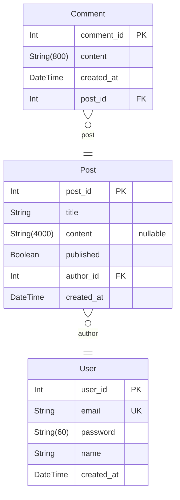
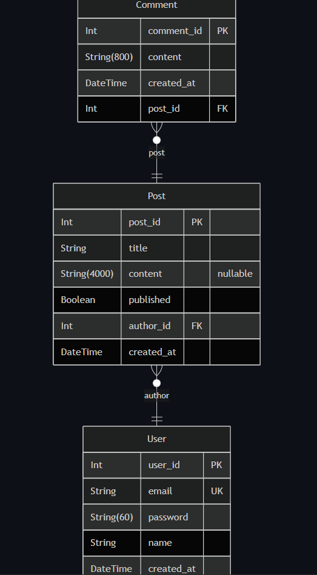

# Sinchon ICPC Camp ERD

> Generated by [`prisma-markdown`](https://github.com/samchon/prisma-markdown)

## ERD(mermaid 익스텐션 필요)

### ERD(image)

### `User`

Properties as follows:

- `user_id`:
- `email`:
- `password`:
- `name`:
- `created_at`:

### `Post`

Properties as follows:

- `post_id`:
- `title`:
- `content`:
- `published`:
- `author_id`:
- `created_at`:

### `Comment`

Properties as follows:

- `comment_id`:
- `content`:
- `created_at`:
- `post_id`:

