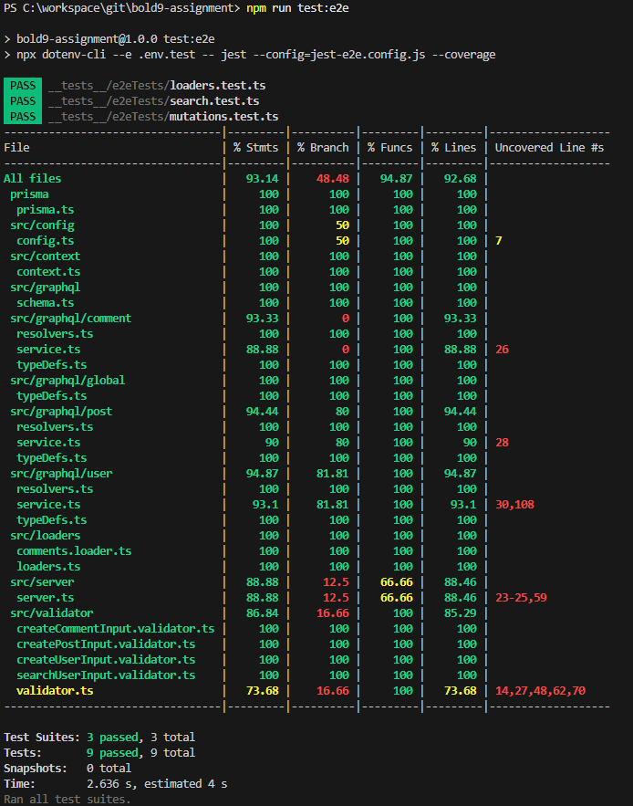

# 테스트 커버리지

- 진행된 테스트 전략과 실제 커버리지 결과를 종합 분석한 내용입니다.
- 기능 보장 및 예외 흐름 처리까지 고려한 구조를 목표로 하였습니다.

---

## 테스트 전략

### Unit Test

- 목표: Resolver, Service, Validator 단위의 로직을 명확히 검증
- 구성:
  - 각 Resolver가 의도한 Service 메서드를 호출하는지 확인
  - 메서드 내부의 예외 처리 흐름까지 테스트
  - `실패 케이스`를 별도 `.fail.test.ts` 파일로 분리

#### 주요 실패 테스트 항목

| 기능                          | 실패 케이스                                                       |
| ----------------------------- | ----------------------------------------------------------------- |
| `createUser`                  | 이메일 형식 오류, 비밀번호 형식 오류, 이름 길이 초과, 중복 이메일 |
| `getUserWithPostsAndComments` | 잘못된 이메일 형식, 존재하지 않는 유저 이메일                                                |
| `createPost`                  | 잘못된 ID 형식, 존재하지 않는 사용자 ID                           |
| `createComment`               | 잘못된 ID 형식, content 길이 초과, 존재하지 않는 Post ID          |

---

### E2E Test

- 목표: GraphQL 전체 흐름 테스트 + DB와의 실제 연동 검증
- 검증 항목:
  1. 주요 Mutation 기능 (createUser, createPost, createComment)
  2. getUserWithPostsAndComments 연관 리졸버 (User → Posts → Comments) 동작 확인
  3. DataLoader 최적화 테스트: N+1 문제 없는지 `쿼리 호출 횟수` 검증

---

## 커버리지

- e2e 테스트 결과

  

- unit 테스트 결과

  
